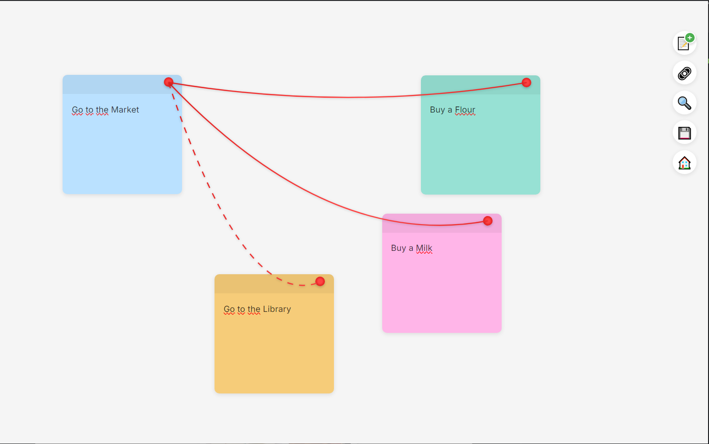

# Clues App

A beautiful sticky notes application built with Electron.js that allows you to create, connect, and organize your thoughts visually.

<div align="center">
  
</div>

> This project is inspired by [Clues.app](https://github.com/f/Clues.app) created by [Fatih Kadir Akın](https://github.com/f) and was built using [Cursor IDE](https://cursor.sh/), an AI-powered code editor.

## Features

- 📝 Create and manage sticky notes
- 🔗 Connect related notes with customizable lines
- 🎨 Customize note colors with a beautiful color palette
- 📱 Drag and drop support for easy organization
- 🖼️ Support for images (drag and drop)
- 💾 Save and load multiple boards
- 🌓 Light/Dark theme support
- ✍️ Rich text formatting (Bold, Italic, Underline, Strikethrough)
- 🔍 Search through your notes
- 📂 Organize multiple boards

## Installation

1. Clone the repository:

```bash
git clone https://github.com/mucahit-sahin/CluesApp.git
```

2. Navigate to the project directory:

```bash
cd CluesApp
```

3. Install dependencies:

```bash
npm install
```

4. Start the application:

```bash
npm start
```

## Usage

### Creating Notes

- Click the "+" button in the toolbar to create a new note
- Drag notes around to organize them
- Double-click on a note to edit its content
- Right-click on a note to:
  - Change its color
  - Delete it

### Connecting Notes

1. Click the chain icon (🔗) in the toolbar to enter connection mode
2. Click on the pin of the first note
3. Click on the pin of the second note to create a connection
4. Choose connection styles:
   - Solid line
   - Dashed line
   - Animated line

### Text Formatting

Select text in a note to access the formatting toolbar:

- **B** - Bold
- _I_ - Italic
- <u>U</u> - Underline
- ~~S~~ - Strikethrough

### Managing Boards

- Save your current board using the save icon (💾)
- Access saved boards from the home screen
- Create multiple boards for different projects or topics
- Delete boards you no longer need

### Additional Features

- Drag and drop images directly onto notes
- Switch between light and dark themes
- Search through your notes and boards
- Automatic saving of changes

## Development

To run the app in development mode:

```bash
npm run dev
```

To build the app:

```bash
npm run build
```

## Technologies Used

- Electron.js
- HTML/CSS
- JavaScript
- Node.js
- [Cursor IDE](https://cursor.sh/) - AI-powered development environment

## Contributing

Contributions are welcome! Please feel free to submit a Pull Request.

## License

This project is licensed under the MIT License - see the [LICENSE](LICENSE) file for details.

## Author

- [mucahit-sahin](https://github.com/mucahit-sahin)

## Acknowledgments

- Thanks to all contributors who have helped shape Clues App
- Special thanks to [Fatih Kadir Akın](https://github.com/f) for the original [Clues.app](https://github.com/f/Clues.app) project that inspired this implementation
- Built with [Cursor IDE](https://cursor.sh/), enhancing development workflow with AI assistance
- Inspired by the need for a better way to organize thoughts and ideas
